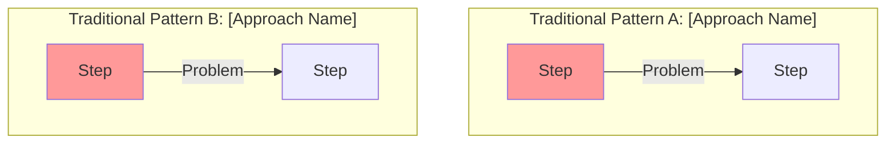

# genX Architecture Documentation Standardization Analysis

## Overview

This analysis identifies common information patterns across all genX Architecture documents, documenting what information should be standardized vs. module-specific, and what key information is missing from various docs.

---

## Executive Summary Section Analysis

### Common Elements (Should be Identical)

All docs should explain:
1. **genx.software Platform Context**: What genx.software is, how universal bootloader works
2. **Polymorphic Syntax Principle**: Multiple notation styles compile identically
3. **Pure Functional Architecture**: No classes for business logic
4. **Privacy-First Processing**: Client-side only, no PII transmission
5. **Performance Guarantees**: <0.2s LCP, 0ms TBT framework-wide
6. **Framework Agnostic**: Works with vanilla HTML, React, Vue, Angular

### Current Variations Found

| Document | Has Platform Context | Has Polymorphic Explanation | Has Pure Functional Principle | Has Privacy Details | Has Performance Targets |
|----------|---------------------|----------------------------|------------------------------|---------------------|------------------------|
| **genx-common-infrastructure** | ✅ Excellent (59 lines) | ✅ Yes - detailed | ✅ Yes - explicit | ✅ Yes - detailed | ✅ Yes - specific metrics |
| **fmtX** | ❌ No - jumps into module | ✅ Yes - brief mention | ❌ Implied only | ✅ Yes - security section | ✅ Yes - performance section |
| **accX** | ⚠️ Minimal | ✅ Yes - mentioned | ✅ Yes - explicit | ✅ Yes - GDPR focus | ✅ Yes |
| **bindX** | ⚠️ Minimal (1 sentence) | ✅ Yes - mentioned | ✅ Yes - explicit | ❌ No | ✅ Yes |
| **dragX** | ⚠️ Minimal | ✅ Yes - mentioned | ✅ Yes - explicit | ⚠️ Brief (4 lines) | ✅ Yes |
| **loadX** | ❌ No | ⚠️ Brief | ⚠️ Implied | ❌ No | ✅ Yes |
| **tableX** | ❌ No | ✅ Yes - decision #1 | ✅ Yes - decision #4 | ❌ No | ✅ Yes |
| **navX** | ❌ No | ✅ Yes - decision #2 | ✅ Yes - decision #1 | ❌ No | ✅ Yes |

**KEY FINDING**: Only genx-common-infrastructure provides complete platform context. Module docs assume reader already understands the platform.

---

## Section 1.1: Current State Architecture

### Purpose
Show developers the problems with current approaches before introducing genx solution.

### Common Pattern (Found in Best Docs)



### Current Status

| Document | Has "Current State" Diagram | Shows Multiple Patterns | Explains Problems |
|----------|----------------------------|------------------------|-------------------|
| **genx-common-infrastructure** | ✅ Yes | ✅ Yes (2 patterns) | ✅ Yes - detailed |
| **fmtX** | ✅ Yes | ✅ Yes (3 patterns: A/B/C) | ✅ Yes |
| **accX** | ✅ Yes | ⚠️ No - shows pain cycle | ✅ Yes |
| **bindX** | ❌ No | ❌ No | ❌ No |
| **dragX** | ❌ No | ❌ No | ❌ No |
| **loadX** | ✅ Yes | ⚠️ Shows current manual | ✅ Yes |
| **tableX** | ✅ Yes | ✅ Yes (3 options) | ✅ Yes |
| **navX** | ❌ No | ❌ No | ⚠️ Brief list only |

**KEY FINDING**: bindX, dragX, navX missing "before genx" problem visualization entirely.

---

## Section 1.2: Integration Points and Dependencies

### Required Standard Elements

1. **Diagram showing genx infrastructure** (bootloader → engine → edge)
2. **List of upstream dependencies** (bootloader, engine, browser APIs)
3. **List of downstream consumers** (use cases)
4. **Optional integrations** (other genx modules, HTMX, frameworks)

### Current Status

| Document | Has Infrastructure Diagram | Lists Dependencies | Shows Module Relationships |
|----------|---------------------------|-------------------|---------------------------|
| **genx-common-infrastructure** | ✅ Yes - complete | ✅ Yes - exhaustive | ✅ Yes - all modules shown |
| **fmtX** | ✅ Yes | ✅ Yes | ⚠️ Minimal |
| **accX** | ✅ Yes | ✅ Yes | ❌ No |
| **bindX** | ⚠️ Minimal (7 lines) | ⚠️ Brief | ❌ No |
| **dragX** | ⚠️ Minimal (11 lines) | ⚠️ Brief | ⚠️ Lists but no explanation |
| **loadX** | ✅ Yes | ⚠️ Brief | ⚠️ Mentions but minimal |
| **tableX** | ✅ Yes | ✅ Yes | ⚠️ Brief |
| **navX** | ⚠️ Minimal | ⚠️ Brief | ❌ No |

**KEY FINDING**: Most modules show dependencies but don't explain the genx platform architecture context.

---

## Section 1.3: Data Flow Patterns

### Required Standard Elements

1. **Sequence diagram** showing:
   - Developer writes HTML
   - Bootloader scans DOM
   - Module loaded & processes
   - DOM updated
   - User sees result

2. **Data flow characteristics** (all should include):
   - Unidirectional flow
   - Client-side only
   - Privacy-preserving
   - Idempotent
   - Immutable source preservation

### Current Status

| Document | Has Sequence Diagram | Lists Flow Characteristics | Shows Bootloader Role |
|----------|---------------------|---------------------------|----------------------|
| **genx-common-infrastructure** | ✅ Yes - excellent | ✅ Yes - complete | ✅ Yes - central |
| **fmtX** | ✅ Yes | ⚠️ Partial (3 bullets) | ⚠️ Minimal |
| **accX** | ✅ Yes | ✅ Yes - 5 bullets | ✅ Yes |
| **bindX** | ✅ Yes | ⚠️ Lists binding types only | ⚠️ Minimal |
| **dragX** | ✅ Yes | ❌ No characteristics listed | ❌ No - jumps into module |
| **loadX** | ✅ Yes | ❌ No characteristics listed | ❌ No |
| **tableX** | ✅ Yes | ❌ No characteristics listed | ⚠️ Brief |
| **navX** | ✅ Yes | ❌ No characteristics listed | ⚠️ Minimal |

**KEY FINDING**: All have diagrams, but only genx-common, fmtX, accX explain the fundamental data flow principles.

---

## Section 1.4: Security Boundaries

### Required Standard Elements

1. **Diagram showing**:
   - Trusted Zone (User's Browser)
   - Untrusted Zone (Network/CDN)
   - Protected Data (PII, content)
   - Data flow boundaries

2. **Security principles** (all should state):
   - Client-side processing only
   - No PII transmission
   - XSS prevention mechanisms
   - CSP compliance
   - GDPR compliance by design

### Current Status

| Document | Has Security Diagram | Lists Security Principles | Explains GDPR Compliance |
|----------|---------------------|--------------------------|-------------------------|
| **genx-common-infrastructure** | ✅ Yes - excellent | ✅ Yes - 5 principles | ✅ Yes - detailed |
| **fmtX** | ✅ Yes | ✅ Yes - 4 principles | ❌ No |
| **accX** | ✅ Yes | ✅ Yes - 6 guarantees | ✅ Yes - explicit |
| **bindX** | ✅ Yes | ✅ Yes - 5 principles | ❌ No |
| **dragX** | ❌ No diagram | ⚠️ 4 bullets only | ❌ No |
| **loadX** | ✅ Yes | ⚠️ Brief | ❌ No |
| **tableX** | ✅ Yes | ✅ Yes - 5 principles | ❌ No |
| **navX** | ❌ No diagram | ⚠️ 5 bullets only | ❌ No |

**KEY FINDING**: Security coverage is inconsistent. GDPR compliance rarely mentioned despite being architectural principle.

---

## Section 2: Technical Design

### Component Architecture (Module-Specific - Good Variation)

✅ Each module correctly shows its own components
✅ Each uses mermaid diagrams
✅ Component responsibilities listed

**No standardization needed here** - this is appropriately module-specific.

### Data Architecture (Module-Specific - Good Variation)

✅ Each shows its own data structures
✅ Most use ER diagrams or interface definitions
✅ Storage patterns explained

**No standardization needed here** - this is appropriately module-specific.

### Polymorphic Architecture Implementation

**ISSUE**: This section varies wildly in:
- Location (some in Exec Summary, some in Technical Design)
- Depth (some show 4 equivalent syntaxes, some just mention it)
- Code examples (some have extensive examples, others none)

**Recommendation**: Standardize this as Section 2.3 in all docs with same format.

---

## Missing Information Audit

### genx-common-infrastructure ✅
- Complete reference document
- Missing: Nothing - this is the gold standard

### fmtX ⚠️
- **Missing**: genx platform overview before diving into formatting
- **Missing**: How bootloader detects and loads fmtX
- **Has**: Otherwise complete

### accX ⚠️
- **Missing**: Detailed genx platform context
- **Missing**: Relationship to other modules
- **Has**: Otherwise excellent, especially accessibility focus

### bindX ❌
- **MISSING**: "Before bindX" problem visualization
- **MISSING**: genx platform architecture explanation
- **MISSING**: Why reactive binding as a genx module (vs Vue/React)
- **Has**: Good technical depth once you get past intros

### dragX ❌
- **MISSING**: "Before dragX" problem visualization
- **MISSING**: genx platform architecture explanation
- **MISSING**: Security diagram (only 4 bullets)
- **Has**: Excellent canvas ghost image section (recently added)

### loadX ❌
- **MISSING**: genx platform architecture explanation
- **MISSING**: Data flow characteristics (has diagram but no principles)
- **MISSING**: Security principles explanation
- **Has**: Good strategy pattern explanation

### tableX ⚠️
- **MISSING**: genx platform architecture explanation
- **MISSING**: Data flow characteristics
- **MISSING**: GDPR/privacy principles
- **Has**: Excellent problem statement and polymorphic examples

### navX ❌❌
- **MISSING**: "Before navX" problem visualization (only 5 bullet list)
- **MISSING**: genx platform architecture explanation
- **MISSING**: Integration diagram (has minimal text-only)
- **MISSING**: Security diagram
- **MISSING**: Data flow characteristics
- **Most incomplete of all module docs**

---

## Standardization Recommendations

### 1. Add Standard "genX Platform Overview" Section (After Title, Before Exec Summary)

**Location**: Between document title and Executive Summary
**Length**: ~20 lines
**Content**: Explain:
- genx.software is declarative web development platform
- Universal bootloader (1KB) loads after first paint
- Polymorphic processing engine handles multiple syntaxes
- Module family (fmtX, accX, bindX, loadX, dragX, tableX, navX)
- Performance guarantees (0ms TBT, <0.2s LCP)
- Framework agnostic philosophy

**Apply to**: All module docs (not genx-common-infrastructure which is the reference)

### 2. Standardize Executive Summary Structure

**All Executive Summaries should have**:
1. **Problem Statement and Business Context** (2-3 paragraphs)
2. **Proposed Solution Overview** (1 paragraph + bullet list)
3. **Key Architectural Decisions** (5 numbered items, including polymorphic + pure functional)
4. **Expected Outcomes and Benefits** (3 sections: Developer / Performance / Business)

**Current**: fmtX and genx-common-infrastructure follow this perfectly. Others vary.

### 3. Standardize Section 1.1 "Current State Architecture"

**All should include**:
- Mermaid diagram showing 2-3 traditional approaches
- "Problems with [Approach]:" explanations
- Use consistent styling (red fill:#f99 for problems)

**Currently missing from**: bindX, dragX, navX (partially present in navX)

### 4. Standardize Section 1.2 "Integration Points and Dependencies"

**All should include**:
- Mermaid diagram showing: genx Infrastructure → Module → Browser
- **Upstream Dependencies** heading with bulleted list
- **Downstream Consumers** heading with bulleted list
- **Integration with Other genx Modules** heading
- **No Framework Dependencies** statement

**Currently weak in**: bindX, dragX, navX, loadX

### 5. Standardize Section 1.3 "Data Flow Patterns"

**All should include**:
- Sequence diagram (Developer → HTML → Bootloader → Module → DOM → User)
- **Data Flow Characteristics** heading with 5 standard bullets:
  - Unidirectional: HTML attributes → transformations → DOM updates
  - Client-side only: No server communication for core features
  - Privacy-preserving: No user data transmitted
  - Idempotent: Re-running produces identical results
  - Immutable source: Original values preserved via data attributes

**Currently missing characteristics from**: dragX, loadX, tableX, navX

### 6. Standardize Section 1.4 "Security Boundaries"

**All should include**:
- Mermaid diagram showing Trusted/Untrusted zones + Protected Data
- **Security Principles** heading with numbered list including:
  1. Client-side processing only
  2. No PII transmission (or explain what is transmitted)
  3. XSS prevention mechanisms
  4. CSP compliance
  5. GDPR compliance by design
  6. [Module-specific security concerns]

**Currently missing diagram from**: dragX, navX
**Currently missing GDPR mention from**: fmtX, bindX, dragX, loadX, tableX, navX

### 7. Add Standard "Polymorphic Syntax Examples" Section

**Location**: Section 2.3 (after Data Architecture, before module-specific sections)
**Content**:
- Show 4 equivalent syntaxes:
  1. Verbose attributes (beginner)
  2. Compact colon syntax (expert)
  3. JSON configuration (power user)
  4. CSS class-based (designer)
- Include comment: "// ALL produce identical output"
- Explain Protocol-based design
- Show factory function pattern

**Currently varies**: Some docs have this, some don't. Some in Exec Summary, some in Technical.

---

## Proposed Document Structure Template

```markdown
# [Module] Technical Architecture Document
## Version 1.0
### October 2025

---

## genX Platform Overview (NEW SECTION - ~20 lines)
[Standard explanation of genx.software platform, bootloader, engine, module family]

---

## Executive Summary

### Problem Statement and Business Context
[2-3 paragraphs explaining the problem this module solves]

### Proposed Solution Overview
[Module] is a declarative [domain] library within the genx.software ecosystem...
- Bullet 1
- Bullet 2
- Bullet 3

**Integration with genx.software platform:** [How this module fits in ecosystem]

### Key Architectural Decisions
1. [Module-specific decision]
2. [Module-specific decision]
3. **Polymorphic Syntax Equivalence**: Multiple notation styles... (STANDARD TEXT)
4. **Pure Functional Processing**: Zero classes in business logic... (STANDARD TEXT)
5. **Privacy-Preserving Architecture**: [Module-specific privacy details]

### Expected Outcomes and Benefits

**Developer Benefits:**
- [Quantified metrics]

**Performance Benefits:**
- [Module performance] + Perfect Lighthouse scores maintained (0ms TBT)

**Business Benefits:**
- [Module business value]

---

## 1. System Context

### 1.1 Current State Architecture (Before [Module])
[Mermaid diagram showing 2-3 traditional problematic approaches]
**Problems with [Approach]:**
- Problem 1
- Problem 2

### 1.2 Integration Points and Dependencies
[Mermaid diagram: genx Infrastructure → [Module] → Browser]

**Upstream Dependencies:**
- genx.software universal bootloader (required)
- genx.software polymorphic processing engine (required)
- [Module-specific browser APIs]

**Downstream Consumers:**
- [Module-specific use cases]

**Integration with Other genx Modules:**
- [Module relationships]

**No Framework Dependencies:** [Standard statement]

### 1.3 Data Flow Patterns
[Sequence diagram: Developer → Bootloader → Module → DOM → User]

**Data Flow Characteristics:**
- **Unidirectional**: [Standard text]
- **Client-side only**: [Standard text]
- **Privacy-preserving**: [Standard text]
- **Idempotent**: [Standard text]
- **Immutable source**: [Standard text]

### 1.4 Security Boundaries
[Mermaid diagram: Trusted/Untrusted zones + Protected Data]

**Security Principles:**
1. **Client-Side Processing**: [Standard text]
2. **XSS Prevention**: [Module specifics]
3. **CSP Compliance**: [Standard text]
4. **GDPR Compliance**: [Standard text]
5. [Module-specific security concerns]

---

## 2. Technical Design

### 2.1 Component Architecture
[Module-specific diagram and explanation]

### 2.2 Data Architecture
[Module-specific data structures, ER diagrams, interfaces]

### 2.3 Polymorphic Syntax Implementation (STANDARDIZED SECTION)
**Core Principle:** Accept any notation style, compile to identical result.

[Show 4 equivalent syntaxes with code examples]
[Protocol-based design explanation]
[Factory function pattern]

### 2.4+ [Module-Specific Sections]
[Module implementation details, algorithms, etc.]

---
```

---

## Summary Statistics

### Documentation Completeness Scores (out of 10)

| Document | Platform Context | Problem Visualization | Integration Docs | Data Flow Explanation | Security Coverage | Overall |
|----------|-----------------|----------------------|------------------|----------------------|------------------|---------|
| **genx-common-infrastructure** | 10/10 | 10/10 | 10/10 | 10/10 | 10/10 | **10.0** ✅ |
| **fmtX** | 2/10 | 9/10 | 8/10 | 7/10 | 8/10 | **6.8** ⚠️ |
| **accX** | 3/10 | 8/10 | 7/10 | 9/10 | 9/10 | **7.2** ⚠️ |
| **bindX** | 1/10 | 2/10 | 4/10 | 5/10 | 7/10 | **3.8** ❌ |
| **dragX** | 2/10 | 2/10 | 5/10 | 6/10 | 5/10 | **4.0** ❌ |
| **loadX** | 1/10 | 7/10 | 5/10 | 5/10 | 5/10 | **4.6** ❌ |
| **tableX** | 1/10 | 9/10 | 7/10 | 5/10 | 7/10 | **5.8** ⚠️ |
| **navX** | 1/10 | 3/10 | 3/10 | 4/10 | 4/10 | **3.0** ❌ |

### Priority Order for Updates

1. **navX** - Most incomplete (3.0/10) - needs comprehensive rewrite of sections 1.1-1.4
2. **bindX** - Missing problem context (3.8/10) - needs section 1.1 added
3. **dragX** - Weak integration docs (4.0/10) - needs sections 1.1, 1.4 improved
4. **loadX** - Missing characteristics (4.6/10) - needs section 1.3, 1.4 standardized
5. **tableX** - Close but needs platform context (5.8/10) - needs genx overview added
6. **fmtX** - Good but needs platform context (6.8/10) - minor additions
7. **accX** - Nearly complete (7.2/10) - minor additions

---

## Next Steps

1. Create standardized "genX Platform Overview" section text (reusable across all docs)
2. Create standardized "Data Flow Characteristics" bullets (reusable across all docs)
3. Create standardized "Security Principles" list (reusable across all docs)
4. Create standardized "Polymorphic Syntax" section template
5. Update each module doc in priority order (navX → bindX → dragX → loadX → tableX → fmtX → accX)
6. Verify all mermaid diagrams use consistent styling (fill:#f99 for problems, fill:#9f9 for solutions)
