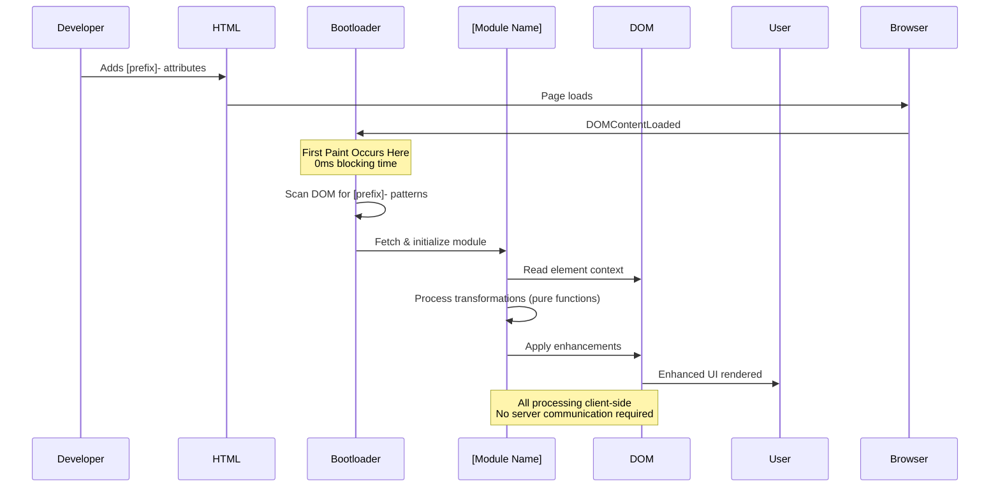

# Standardized Text Blocks for genX Architecture Documents

This file contains reusable, standardized text blocks that should appear consistently across all genX module architecture documents.

---

## BLOCK 1: genX Platform Overview (Insert after title, before Executive Summary)

```markdown
---

## genX Platform Overview

[Module name] is part of the **genx.software** declarative web development platform, which fundamentally reimagines how web features are implemented. Understanding this platform context is essential to understanding this module's architecture.

**genx.software Core Architecture:**

The platform consists of three foundational components:

1. **Universal Bootloader (1KB)**: A single, identical loader for all users that loads after first paint. The bootloader scans the DOM for declarative attributes (`fx-`, `ax-`, `bx-`, `dx-`, `lx-`, `tx-`, `nx-`), detects required transformations, and dynamically loads only needed modules. This inverts the traditional "load everything upfront" paradigm.

2. **Polymorphic Processing Engine**: Pure functional JavaScript engine that processes multiple notation styles (HTML attributes, CSS classes, JSON configuration) through a unified pipeline. Developers choose their preferred syntax without performance penalty—all compile to identical transformations.

3. **Edge Compilation Service** (optional, paid tier): Server-side optimization that pre-compiles personalized bundles with ML-driven improvements. Critically, only transformation patterns are transmitted (never user data), maintaining privacy-first architecture.

**Module Family:**
- **fmtX**: Declarative formatting (currency, dates, numbers, phone)
- **accX**: Declarative accessibility (WCAG compliance, ARIA)
- **bindX**: Declarative reactive data binding
- **loadX**: Declarative loading states (spinners, skeletons, progress)
- **dragX**: Declarative drag-and-drop interactions
- **tableX**: Declarative table enhancements (sort, paginate, responsive)
- **navX**: Declarative navigation and breadcrumbs

**Performance Guarantees:**
- **0ms Total Blocking Time (TBT)**: Bootloader loads after first paint
- **<0.2s Largest Contentful Paint (LCP)**: On-demand module loading
- **Perfect Lighthouse scores**: Maintained across all modules
- **<16ms operations**: 60 FPS interaction guarantee

**Framework Agnostic Philosophy:**
genx explicitly avoids depending on React, Vue, Angular, or any framework. This enables universal adoption across all web stacks—from vanilla HTML to modern SPA frameworks to WordPress and CMSs.

---
```

---

## BLOCK 2: Polymorphic Syntax Architectural Decision

**Insert as Decision #3 or #4 in "Key Architectural Decisions" section**

```markdown
**Polymorphic Syntax Equivalence**: Multiple notation styles (HTML attributes, CSS classes, JSON configuration) compile to identical transformations. This reduces cognitive load—developers use their preferred syntax without performance penalty. Beginners use verbose attributes, experts use compact colon syntax, designers use CSS classes. All produce the same result through the polymorphic processing engine.
```

---

## BLOCK 3: Pure Functional Processing Architectural Decision

**Insert as Decision #4 or #5 in "Key Architectural Decisions" section**

```markdown
**Pure Functional Processing**: Zero classes in business logic. All transformations are pure functions with explicit dependencies, enabling perfect caching and predictable performance. This follows elite JavaScript architecture principles—classes destroy performance through cache misses and heap traversal, while pure functions with immutable data structures achieve 50x improvements.
```

---

## BLOCK 4: Privacy-Preserving Architecture Decision

**Insert as Decision #5 in "Key Architectural Decisions" section**

```markdown
**Privacy-Preserving Architecture**: All core processing occurs client-side. No user data (PII, form inputs, page content) is ever transmitted to servers. For paid-tier edge optimization, only transformation patterns (e.g., "site uses [module prefix]-[feature]") are transmitted—never the actual data. This makes genx GDPR-compliant by design.
```

---

## BLOCK 5: Framework Agnostic Benefit

**Insert in "Expected Outcomes and Benefits" → "Developer Benefits" section**

```markdown
- Zero framework lock-in (works identically with React, Vue, Angular, Svelte, vanilla HTML, WordPress)
```

---

## BLOCK 6: Perfect Lighthouse Scores Benefit

**Insert in "Expected Outcomes and Benefits" → "Performance Benefits" section**

```markdown
- Perfect Lighthouse scores maintained (0ms TBT, <0.2s LCP)
```

---

## BLOCK 7: Integration Points - Standard Dependencies List

**Insert in Section 1.2 "Integration Points and Dependencies"**

```markdown
**Upstream Dependencies:**
- genx.software universal bootloader (required)
- genx.software polymorphic processing engine (required)
- [Module-specific browser APIs - LIST THEM]
- Edge compilation service (optional, paid tier only)

**Downstream Consumers:**
- [Module-specific use cases - LIST THEM]

**Integration with Other genx Modules:**
- Works seamlessly with all genx modules (fmtX, accX, bindX, loadX, dragX, tableX, navX)
- [Module-specific integrations if any - SPECIFY THEM]
- Optional enhancement when multiple modules present (e.g., accX improves accessibility automatically)

**No Framework Dependencies:**
genx explicitly avoids depending on React, Vue, Angular, or any framework. This enables universal adoption across all web stacks.
```

---

## BLOCK 8: Data Flow Characteristics

**Insert in Section 1.3 "Data Flow Patterns" after the sequence diagram**

```markdown
**Data Flow Characteristics:**
- **Unidirectional**: HTML attributes → [module] transformations → DOM updates (no circular dependencies)
- **Client-side only**: No server communication required for core features (all processing in browser)
- **Privacy-preserving**: No user data transmitted (only transformation patterns for edge optimization)
- **Idempotent**: Re-running on same element produces identical result (safe to re-process)
- **Immutable source**: Original values preserved via data attributes (reversible transformations)
```

---

## BLOCK 9: Security Principles

**Insert in Section 1.4 "Security Boundaries" after the diagram**

```markdown
**Security Principles:**

1. **Client-Side Processing Only**: All transformations occur in the browser. No user data, PII, form inputs, or page content transmitted to servers.

2. **XSS Prevention**:
   - No `eval()` or `Function()` constructor usage
   - No `innerHTML` manipulation of user-provided data
   - All dynamic content uses `textContent` or sanitized insertion
   - Expression evaluation restricted to safe subset

3. **Content Security Policy (CSP) Compliance**:
   - No inline scripts or styles generated
   - All code loaded from CDN with Subresource Integrity (SRI) hashes
   - Compatible with strict CSP policies

4. **GDPR Compliance by Design**:
   - No cookies, no tracking, no analytics by default
   - No PII collection at any point in pipeline
   - Edge optimization only receives transformation patterns, never user data
   - Full compliance without configuration

5. **Input Validation**:
   - All attribute values validated before processing
   - Malformed configurations fail safely with warnings
   - No silent data corruption

6. [Module-Specific Security Concerns]:
   [ADD MODULE-SPECIFIC SECURITY CONSIDERATIONS HERE]
```

---

## BLOCK 10: Standard Mermaid Diagram Styling

**Use these consistent styles across all mermaid diagrams:**

```
Problems/Bad patterns:     style X fill:#f99
Solutions/Good patterns:   style X fill:#9f9
genx Infrastructure:       style X fill:#99f
Optional/Edge services:    style X fill:#ff9
Module-specific:           style X fill:#9cf
Cross-cutting concerns:    style X fill:#fcf
```

---

## BLOCK 11: Integration Points Mermaid Diagram Template

**Use in Section 1.2 "Integration Points and Dependencies"**

```mermaid
graph LR
    subgraph "genx.software Infrastructure"
        Boot[Universal Bootloader<br/>1KB]
        Engine[Polymorphic Engine<br/>4KB]
        Edge[Edge Compilation<br/>Optional]
    end

    subgraph "[Module Name] Library"
        Core[[Module] Core<br/>[X]KB]
        Features[Feature Modules<br/>[X]KB each]
    end

    subgraph "Browser Environment"
        DOM[DOM API]
        APIs[Browser APIs<br/>[LIST SPECIFIC APIS]]
    end

    Boot -->|Detects [prefix]- attributes| Core
    Core -->|Uses| Engine
    Core -->|Lazy loads| Features
    Core -->|Manipulates| DOM
    Core -->|Uses| APIs
    Edge -.->|Optimizes| Core

    style Boot fill:#99f
    style Engine fill:#99f
    style Core fill:#9cf
```

---

## BLOCK 12: Security Boundaries Mermaid Diagram Template

**Use in Section 1.4 "Security Boundaries"**

```mermaid
graph TB
    subgraph "Trusted: Browser Context"
        UserBrowser[User's Browser]
        UserHTML[User's HTML]
        ModuleEngine[[Module] Engine]
        EnhancedDOM[Enhanced DOM]
    end

    subgraph "Untrusted: Network"
        CDN[CDN Distribution]
        Edge[Edge Compilation<br/>Optional]
    end

    subgraph "Protected Data"
        PII[User PII]
        Content[Page Content]
        FormData[Form Data]
    end

    UserHTML -->|Validated attributes| ModuleEngine
    CDN -->|Signed bundles<br/>SRI hashes| ModuleEngine
    ModuleEngine -->|Transforms| EnhancedDOM
    PII -.Never leaves.-> UserBrowser
    Content -.Never leaves.-> UserBrowser
    FormData -.Never leaves.-> UserBrowser
    Edge -.->|Pattern optimization<br/>No user data| ModuleEngine

    style PII fill:#9f9
    style Content fill:#9f9
    style FormData fill:#9f9
    style CDN fill:#ff9
    style Edge fill:#ff9
    style ModuleEngine fill:#9cf
```

---

## BLOCK 13: Data Flow Sequence Diagram Template

**Use in Section 1.3 "Data Flow Patterns"**



---

## BLOCK 14: Polymorphic Syntax Examples Template

**Use in Section 2.3 "Polymorphic Syntax Implementation"**

```markdown
### 2.3 Polymorphic Syntax Implementation

**Core Principle**: Accept any notation style, compile to identical result through unified processing pipeline.

**Example: All Four Syntaxes Produce Identical Output**

```javascript
// Notation 1: Verbose Attributes (Beginner-Friendly)
<[element] [prefix]-[feature]="[value]"
           [prefix]-[option1]="[value1]"
           [prefix]-[option2]="[value2]">

// Notation 2: Compact Colon Syntax (Expert)
<[element] [prefix]-[feature]="[value]:[value1]:[value2]">

// Notation 3: JSON Configuration (Power User)
<[element] [prefix]-[feature]="[value]"
           [prefix]-opts='{"[option1]":"[value1]","[option2]":"[value2]"}'>

// Notation 4: CSS Classes (Designer-Friendly)
<[element] class="[prefix]-[feature]-[value]-[option1]-[value1]-[option2]-[value2]">

// ALL produce identical output: [SHOW RESULT]
```

**Protocol-Based Processing**:

```javascript
// Pure functional polymorphic parser
const parseElement = (element) => {
    const configs = [];

    // Parse verbose attributes
    for (let attr of element.attributes) {
        if (attr.name.startsWith('[prefix]-')) {
            configs.push(parseAttribute(attr));
        }
    }

    // Parse compact colon syntax
    const compact = parseCompactSyntax(element);
    if (compact) configs.push(compact);

    // Parse JSON options
    const json = parseJSONOptions(element);
    if (json) configs.push(json);

    // Parse CSS classes
    for (let cls of element.classList) {
        if (cls.startsWith('[prefix]-')) {
            configs.push(parseClassSyntax(cls));
        }
    }

    // Merge (last wins for conflicts)
    return Object.freeze(Object.assign({}, ...configs));
};
```

**Factory Pattern for Processors**:

```javascript
// Factory creates processor based on parsed config
const createProcessor = (element) => {
    const config = parseElement(element);

    // Validate protocol compliance
    validateConfig(config);

    // Return appropriate processor (pure functions)
    return Object.freeze({
        process: () => processElement(element, config),
        cleanup: () => cleanupElement(element, config),
        update: (newConfig) => updateElement(element, newConfig)
    });
};
```
```

---

## Usage Instructions

1. **For each module document**, identify which blocks are missing
2. **Copy the appropriate block** from this file
3. **Replace bracketed placeholders** with module-specific information:
   - `[Module name]` → e.g., "navX", "fmtX", etc.
   - `[prefix]` → e.g., "nx", "fx", etc.
   - `[X]KB` → actual bundle size
   - `[LIST THEM]` → module-specific details
4. **Maintain consistent formatting** and mermaid diagram styling
5. **Verify mermaid diagrams render** after insertion

---

## Customization Guidelines

### When to Customize

- **Problem statements**: Module-specific in Executive Summary
- **Component architecture**: Completely module-specific
- **Data structures**: Completely module-specific
- **Code examples**: Module-specific implementations

### When NOT to Customize

- Platform overview (BLOCK 1): Keep identical across all modules
- Security principles (BLOCK 9): Keep core 5 principles identical
- Data flow characteristics (BLOCK 8): Keep identical
- Diagram styling (BLOCK 10): Keep consistent

### Allowed Variations

- Security principle #6 should be module-specific
- Integration points list content (but keep structure)
- Sequence diagram participant names (but keep structure)
- Polymorphic syntax examples (show module-specific attributes)

---

## Quality Checklist

Before marking a document as "standardized", verify:

- [ ] BLOCK 1 (Platform Overview) appears after title, before Exec Summary
- [ ] Executive Summary includes polymorphic + pure functional decisions
- [ ] Section 1.1 shows "before genx" problem visualization with diagram
- [ ] Section 1.2 has integration diagram using standard styling
- [ ] Section 1.3 has data flow sequence diagram + characteristics list
- [ ] Section 1.4 has security boundaries diagram + principles list
- [ ] Section 2.3 has polymorphic syntax examples with 4 notations
- [ ] All mermaid diagrams use consistent styling (fill:#f99, fill:#9f9, etc.)
- [ ] GDPR compliance explicitly mentioned in security section
- [ ] Framework agnostic principle stated in at least 2 places
- [ ] Performance guarantees (0ms TBT, <0.2s LCP) mentioned
